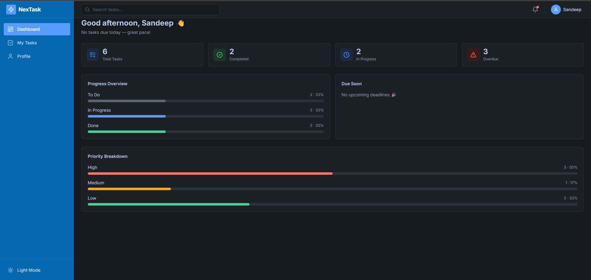

# 🚀 NexTask

NexTask is a modern, high-performance task management application designed to streamline workflows with an interactive Kanban board. It features drag-and-drop card movement, comprehensive productivity analytics, dynamic dark/light mode, and client-side state persistence.



---

## 🔗 Live Demo
Check out the live application here: **[NexTask Live Link](https://nextask-pi.vercel.app/)** *(Replace with your active Vercel link)*

---

## 🛠️ Tech Stackdoc

- **Framework**: [React 19](https://react.dev/)
- **Build Tool**: [Vite](https://vite.dev/)
- **Language**: [TypeScript](https://www.typescriptlang.org/)
- **Styling**: [Tailwind CSS v4](https://tailwindcss.com/)
- **Drag-and-Drop**: [@dnd-kit/core](https://dnd-kit.com/)
- **Routing**: [React Router v7](https://reactrouter.com/)
- **Forms & Validation**: [React Hook Form](https://react-hook-form.com/) & [Zod](https://zod.dev/)
- **Icons**: [Lucide React](https://lucide.dev/)

---

## ✨ Features

- 📋 **Dynamic Kanban Board**: Seamless drag-and-drop task card movement across `To Do`, `In Progress`, and `Done` columns powered by `@dnd-kit`.
- 📊 **Productivity Dashboard**: Real-time stats showing completion rate, priority counts (Low/Medium/High), overdue alerts, and list of tasks due soon.
- 🔍 **Instant Search & Filter**: Filter through your tasks instantly by title or description directly on the task board.
- 🌓 **Aesthetic Dark/Light Theme**: Sleek, eye-pleasing theme toggle built using CSS custom variables for seamless transitions.
- 💾 **Local Storage Persistence**: Automatic client-side saving so your tasks are preserved when reloading.
- 🧪 **Robust Form Validation**: Forms backed by `react-hook-form` and `zod` to prevent invalid entries.

---

## 🚀 How to Run Locally

### Prerequisites
Make sure you have [Node.js](https://nodejs.org/) installed (v18+ recommended).

### Steps
1. **Clone the Repository**
   ```bash
   git clone https://github.com/Sandeep9306/nextask.git
   cd nextask
   ```

2. **Install Dependencies**
   ```bash
   npm install
   ```

3. **Start the Development Server**
   ```bash
   npm run dev
   ```
   Open [http://localhost:5173](http://localhost:5173) in your browser to view the application!

4. **Build for Production**
   ```bash
   npm run build
   ```

---

## 📂 Project Structure

```text
src/
├── components/     # Reusable UI elements (Modal, Button, etc.)
├── context/        # TaskProvider & ThemeProvider
├── features/       # Feature-specific logic (Dashboard & Tasks)
├── hooks/          # Custom hooks (useTasks, useTheme, etc.)
├── layouts/        # Page layouts (RootLayout, Sidebar)
├── pages/          # App pages (Dashboard, Tasks, Profile)
└── types/          # TypeScript definitions
```